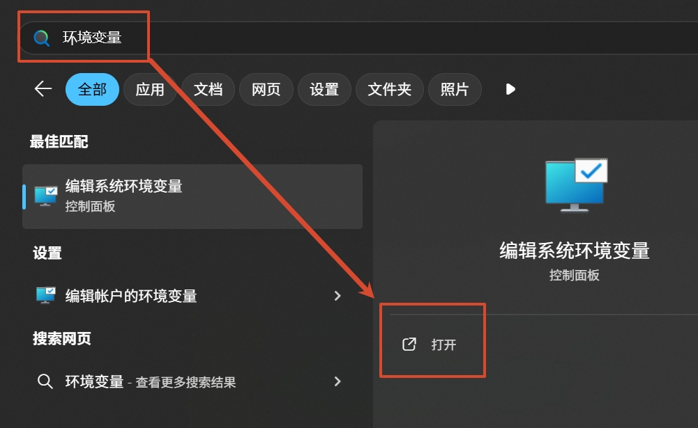
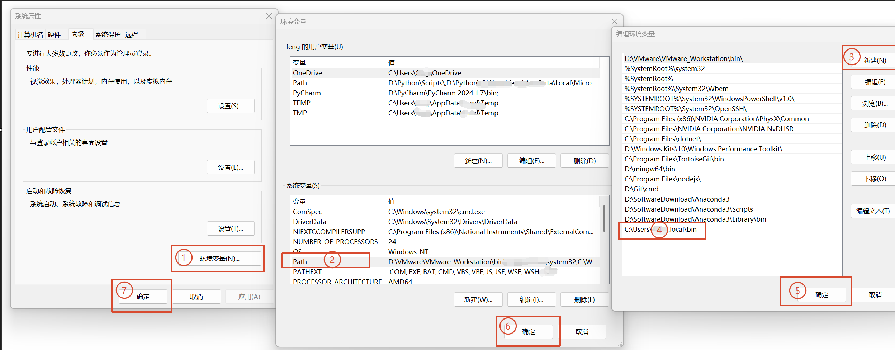
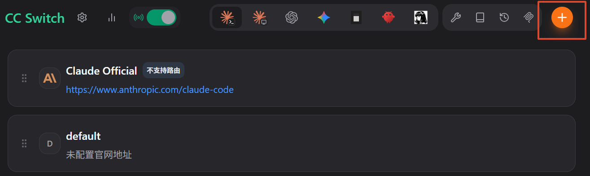

---
# 文章标题
title: "Claude Code 终端使用攻略"

# 发表日期
published: 2026-06-23

# 更新日期
updated: 2026-06-23

# 文章标签
tags: ["Claude Code", "CC-Switch"]

# 分类
categories: "others"

# 文章封面图片
image: "./ChatGPT Image 2026年6月23日 13_35_40.png"

# 描述
description: "从 Claude Code 到 CC-Switch 的下载安装攻略教程"

# 是否为草稿
draft: false

# 作者
author: "清风不是F."

# URL路径
slug: "claudecode-and-ccswitch-install"
---


## Claude Code 终端使用攻略

<!--  -->

### 一、安装并配置 Claude Code

1. 下载并安装官方程序
    在终端运行 Anthropic 官方提供的[一键命令脚本](https://code.claude.com/docs/en/overview)：

```bash
# macOS/Linux/WSL:
curl -fsSL https://claude.ai/install.sh | bash

# Windows PowerShell:
irm https://claude.ai/install.ps1 | iex

# Windows CMD:
curl -fsSL https://claude.ai/install.cmd -o install.cmd && install.cmd && del install.cmd
```

> *注：* 这里需保证终端可正常访问官网服务，可先在终端中执行：
> ```bash
> # Windows
> $env:http_proxy="http://127.0.0.1:你的代理端口"
> $env:https_proxy="http://127.0.0.1:你的代理端口"
> # Linux/macOS
> export http_proxy="http://127.0.0.1:你的代理端口"
> export https_proxy="http://127.0.0.1:你的代理端口"
>```

1. 为终端配置系统环境变量
- **Windows ：**
      a. 在开始菜单中搜索环境变量并打开：

      b. 添加环境变量，Claude Code 在 Windows 系统中的实际安装路径（一般是：C:\Users\你的用户名.local\bin）：


- **Linux：**
      程序默认安装在 ~/.local/bin 下，将其添加到bash或zsh（Shell你的命令解释器）的路径中，确保执行claude可调用

```bash
# 1. 将安装路径追加到zsh配置文件末尾
echo 'export PATH="$HOME/.local/bin:$PATH"' >> /.bashrc

# 2. 刷新配置文件，使设置立即生效
source ~/.bashrc
```


### 二、从GitHub 下载并安装 CC-Switch

1. 访问GitHub下载适合你操作系统的安装包：[https://github.com/farion1231/cc-switch/releases](https://github.com/farion1231/cc-switch/releases)

2. 手动（Windows直接双击安装跟着指引操作即可）或通过命令行（Linux）安装适用于你发行版的安装包, 这里以Ubuntu安装CC-Switch-v3.16.3为例
```bash
# 从GitHub下载好安装包后
cd ~/Downloads
sudo dpkg -i CC-Switch-v3.16.3-Linux-x86_64.deb
```


### 三、CC-Switch 使用

进入界面点击+，填写好信息点击添加即可在终端调用claude使用。




以上就是Claude Code 终端使用的讲解，觉得有帮助的话，欢迎点赞👍收藏🔖关注👀~