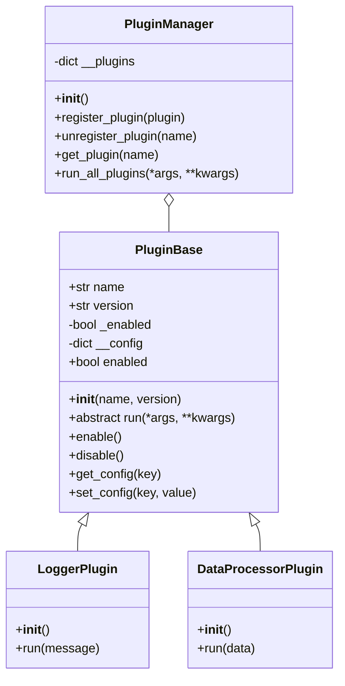

---
# 文章标题
title: "OOP 三大特性"

# 发表日期
published: 2026-06-02

# 更新日期
updated: 2026-06-02

# 标签
tags: ["OOP 三大特性", "封装", "继承", "多态", "python"]

# 分类
category: "python"

# 文章封面图片
image: "./ChatGPT Image 2026年6月1日 12_57_28.png"

# 描述
description: "本文分别讲解面向对象（OOP）的三大特性：封装、继承、多态。"

# 是否为草稿
draft: false

# 作者
author: "清风不是F."

# URL路径
slug: "oop-three-features"
---


# Python 面向对象编程的深度解析：封装、继承、多态及其底层支撑

<!--  -->

---

## 开篇：从 "面条代码" 到结构化设计

想象你正在开发一个员工信息管理系统。最初只有 10 个员工，你用几个列表存储姓名、部门、工资，写了几个函数处理增删改查。

三个月后，系统需要支持员工绩效、考勤、社保的计算。你不得不添加更多全局列表：`performance_scores`、`attendance_records`、`social_insurance`。每个函数的参数也越来越长，`calculate_salary(employee_id, name, department, base_salary, performance, attendance)` ……

但在第六个月时：老板要求增加 "实习生" 和 "外包员工" 两种类型，他们的工资计算方式完全不同。你发现自己需要在每个函数里加无数个`if-else`判断，修改一个地方会导致三个地方出 bug。全局变量像病毒一样扩散，代码变成了牵一发而动全身的 "面条"。

这就是面向对象编程诞生要解决的核心问题：**管理不断增长的软件复杂度**。而封装、继承、多态这三大特性，正是 Python 为我们提供的三把利器：

- **封装**：把数据和操作数据的方法打包在一起，隐藏内部细节，暴露统一接口
- **继承**：建立类之间的层次关系，实现代码复用和类型扩展
- **多态**：让不同类的对象响应同一个接口，实现 "一个接口，多种实现"

---

## 封装：不只是下划线的艺术

封装的核心思想是 **"最小权限原则"**：只暴露必要的接口给外部，隐藏所有实现细节。Python 没有像 Java 那样的`public`/`private`/`protected`关键字，而是通过命名约定和语言机制来实现不同级别的访问控制。

### 保护意图的三级分级

Python 提供了三种级别的属性保护：

|命名方式|含义|底层机制|适用场景|
|---|---|---|---|
|`name`|公有属性|无特殊处理|对外暴露的稳定接口|
|`_name`|受保护属性|约定俗成，`from module import *`时被忽略|类内部和子类使用的细节|
|`__name`|私有属性|**名称改写 (Name Mangling)**|防止被子类意外覆盖的关键内部状态|

#### 1. 单下划线：约定的细节

单下划线是 Python 中最常用的保护方式，它完全是一种约定，解释器不会做任何强制检查。它的作用是告诉其他开发者："这个属性 / 方法是类的内部实现细节，不应该被外部直接调用"。

```python
import hashlib
class User:
    def __init__(self, username, password):
        self.username = username  # 公有属性
        self._password_hash = self._hash_password(password)  # 受保护属性
    
    def _hash_password(self, password):  # 受保护方法
        # 内部实现的密码哈希函数
        return hashlib.sha256(password.encode()).hexdigest()
    
    def verify_password(self, password):
        # 对外暴露的验证接口
        return self._password_hash == self._hash_password(password)
```

**重要特性**：当使用`from module import *`导入模块时，所有以单下划线开头的名称都会被忽略。这是 Python 模块级别的封装机制。

#### 2. 双下划线：名称改写机制

双下划线不是真正的私有，而是触发了 Python 的**名称改写**机制：解释器会自动将`__name`改写为`_ClassName__name`，从而避免子类意外覆盖父类的属性。

```python
class Base:
    def __init__(self):
        self.__private = "父类私有属性"
        self._protected = "父类受保护属性"
    
    def get_private(self):
        return self.__private

class Derived(Base):
    def __init__(self):
        super().__init__()
        self.__private = "子类私有属性"  # 不会覆盖父类的__private
        self._protected = "子类受保护属性"  # 会覆盖父类的_protected

# 实例化并查看属性
d = Derived()
print(d._protected)  # 输出: 子类受保护属性
print(d.get_private())  # 输出: 父类私有属性

# 查看对象的__dict__，揭示名称改写的真相
print(d.__dict__)
# 输出: {'_Base__private': '父类私有属性', '_protected': '子类受保护属性', '_Derived__private': '子类私有属性'}
```

从`__dict__`的输出可以看到：

- 父类的`__private`被改写成了`_Base__private`
- 子类的`__private`被改写成了`_Derived__private`
- 两者互不干扰，这便是双下划线的真正目的：**防止命名冲突**，而不是绝对私有。


### 受控访问的核心：@property 与描述符协议

真正的封装不是简单地隐藏属性，而是**提供受控的访问方式**，在获取、设置或删除属性时执行必要的逻辑（如校验、计算、日志记录等）。Python 的`@property`装饰器是实现这一目标的最佳方式。

#### 案例 1：温度转换类

```python
class Temperature:
    def __init__(self, celsius=0):
        self.celsius = celsius  # 直接调用setter
    
    @property
    def celsius(self):
        """摄氏温度"""
        return self._celsius
    
    # @xxx.setter：setter（设置值）
    @celsius.setter
    def celsius(self, value):
        if value < -273.15:
            raise ValueError("温度不能低于绝对零度(-273.15°C)")
        self._celsius = value
    
    @property
    def fahrenheit(self):
        """华氏温度,摄氏温度的1.8倍加32"""
        return self.celsius * 1.8 + 32
    
    @fahrenheit.setter
    def fahrenheit(self, value):
        self.celsius = (value - 32) / 1.8
    
    # @xxx.deleter：deleter（删除属性）
    @fahrenheit.deleter
    def fahrenheit(self):
        print("删除华氏温度属性，重置为0°C")
        self.celsius = 0

# 使用示例
t = Temperature(25)
print(t.celsius)  # 25
print(t.fahrenheit)  # 77.0

t.fahrenheit = 32
print(t.celsius)  # 0.0

del t.fahrenheit  # 输出: 删除华氏温度属性，重置为0°C
print(t.celsius)  # 0.0
```

>*注意：* 在 @property 和 @xxx.setter 中，不能使用 self.celsius 来存取值，必须使用 self._celsius，否则会导致死循环递归报错。

由此可看出`@property`的强大之处：

- 我们可以像访问普通属性一样访问`celsius`和`fahrenheit`
- 但在设置时会自动执行校验逻辑
- 两个属性保持同步，无需手动维护
- 支持删除操作，可以执行清理逻辑

#### 案例 2：手工实现 MyProperty 描述符

`@property`其实是**描述符协议**的一种应用。描述符是 Python 中最强大的底层机制之一，它允许我们定义一个类，来控制另一个类的属性访问。

通常一个数据描述符需要实现以下三个方法：

- `__get__(self, instance, owner)` ：获取属性
- `__set__(self, instance, value)` ：设置属性
- `__delete__(self, instance)`     ：删除属性


```python
class MyProperty:
    def __init__(self, fget=None, fset=None, fdel=None):
        self.fget = fget
        self.fset = fset
        self.fdel = fdel
    
    def __get__(self, instance, owner):
        if instance is None:
            return self  # 当通过类访问时，返回描述符本身
        if self.fget is None:
            raise AttributeError("unreadable attribute")
        return self.fget(instance)
    
    def __set__(self, instance, value):
        if self.fset is None:
            raise AttributeError("can't set attribute")
        self.fset(instance, value)
    
    def __delete__(self, instance):
        if self.fdel is None:
            raise AttributeError("can't delete attribute")
        self.fdel(instance)
    
    def getter(self, fget):
        # return 新的MyProperty(新的getter, 旧的setter, 旧的deleter)
        return type(self)(fget, self.fset, self.fdel)
    
    def setter(self, fset):
        # return 新的MyProperty(旧的getter, 新的setter, 旧的deleter)
        return type(self)(self.fget, fset, self.fdel)
    
    def deleter(self, fdel):
        # return 新的MyProperty(旧的getter, 旧的setter, 新的deleter)
        return type(self)(self.fget, self.fset, fdel)

# 使用MyProperty重写Temperature类
class Temperature:
    def __init__(self, celsius=0):
        self.celsius = celsius
    
    @MyProperty
    def celsius(self):
        return self._celsius
    
    @celsius.setter
    def celsius(self, value):
        if value < -273.15:
            raise ValueError("温度不能低于绝对零度")
        self._celsius = value
```

`@property`的底层原理：它只是一个实现了描述符协议的类，将属性的访问转发给我们定义的 getter、setter 和 deleter 方法。

#### 案例 3：银行账户类

银行账户类的示例：

```python
from datetime import datetime
class BankAccount:
    def __init__(self, account_number, initial_balance=0):
        self.account_number = account_number
        self.__balance = initial_balance  # 用双下划线隐藏余额
        self.__transaction_history = []  # 交易记录
    
    @property
    def balance(self):
        """只读的余额属性"""
        return self.__balance
    
    def deposit(self, amount):
        """存款"""
        if amount <= 0:
            raise ValueError("存款金额必须为正数")
        self.__balance += amount
        self.__transaction_history.append(("存款", amount, datetime.now()))
        return True
    
    def withdraw(self, amount):
        """取款"""
        if amount <= 0:
            raise ValueError("取款金额必须为正数")
        if amount > self.__balance:
            raise ValueError("余额不足")
        self.__balance -= amount
        self.__transaction_history.append(("取款", amount, datetime.now()))
        return True
    
    def get_transaction_history(self):
        """获取交易记录（返回副本，防止外部修改）"""
        return self.__transaction_history.copy()
```

总结：
|知识点|本案例中的用法|作用|
|---|---|---|
|双下划线 `__xxx`|`__balance`、`__transaction_history`|私有属性，彻底隐藏、安全|
|`@property`|`balance` 只读属性|只能查看，不能修改|
|数据校验|存款 / 取款的判断逻辑|杜绝非法操作|
|封装|隐藏数据，开放安全方法|面向对象核心原则|
|列表 `.copy()`|保护交易记录不被篡改|数据安全细节|


---

## 继承：复用与层次的底层逻辑

继承：**承接原有能力，拓展全新行为。** 
它描述了类之间 "是一个"【is-a 关系】，如果能说出 A 是一种 B，那么 A（子类）就可以继承 B（父类），例如："特斯拉是一辆电动汽车，电动汽车是一种交通工具"。同时，要与组合 "有一个"【has-a 】区分，组合是 A 里面有一个 B，而不是 A 是一种 B，例如："汽车有一个轮胎，但不能说轮胎是一种汽车/汽车是一种轮胎"。

### 单继承与 super () 的协作

单继承是最简单也最常用的继承方式。在 Python 中，所有类都默认继承自`object`（新式类）。

```python
class Vehicle:
    def __init__(self, brand, model, year):
        self.brand = brand
        self.model = model
        self.year = year
    
    def start(self):
        return f"{self.brand} {self.model} 启动了"

class ElectricCar(Vehicle):
    def __init__(self, brand, model, year, battery_capacity):
        # 调用父类的构造方法
        super().__init__(brand, model, year)
        self.battery_capacity = battery_capacity  # 扩展属性
    
    def start(self):
        # 重写父类方法
        parent_start = super().start()  # 调用父类的start方法
        return f"{parent_start}，电机嗡嗡作响"

class Tesla(ElectricCar):
    def __init__(self, model, year, battery_capacity, autopilot_version):
        super().__init__("Tesla", model, year, battery_capacity)
        self.autopilot_version = autopilot_version
    
    def start(self):
        return f"{super().start()}，自动驾驶系统v{self.autopilot_version}已激活"

# 使用示例
model3 = Tesla("Model 3", 2026, 75, "FSD")
print(model3.start())
# 输出: Tesla Model 3 启动了，电机嗡嗡作响，自动驾驶系统vFSD已激活
```


### 多继承与 MRO（方法解析顺序）机制

> **MRO = Method Resolution Order（方法解析顺序）**:
> 当你调用一个方法 / 属性时，Python 按照固定的路线 去类的继承链里找这个方法，这个固定路线就是 MRO。

Python 支持多继承，即一个类可以同时继承多个父类。这带来了强大的代码复用能力，但也引入了一个经典问题：**菱形继承问题**。

考虑以下菱形继承结构：

```plaintext
        A (顶层父类)
       / \
      /   \
     B     C  (两个子类，都继承A)
      \   /
       \ /
        D    (孙子类，同时继承B和C)
```

*Q：* 当 D 调用一个在 A 中定义但 B 和 C 都重写了的方法时，应该调用 B 的版本还是 C 的版本？
*A：* Python 通过**C3 线性化算法**来解决这个问题，它会生成一个唯一的、确定的方法解析顺序列表。

#### 案例：菱形继承与 MRO

```python
class A:
    def __init__(self):
        print("A初始化")
        self.value = "A"

class B(A):
    def __init__(self):
        print("B初始化开始")
        super().__init__()
        print("B初始化结束")
        self.value += "B"

class C(A):
    def __init__(self):
        print("C初始化开始")
        super().__init__()
        print("C初始化结束")
        self.value += "C"

class D(B, C):
    def __init__(self):
        print("D初始化开始")
        super().__init__()
        print("D初始化结束")
        self.value += "D"

# 查看D的MRO
print(D.__mro__)
# 输出: (<class '__main__.D'>, <class '__main__.B'>, <class '__main__.C'>, <class '__main__.A'>, <class 'object'>)

# 实例化D，观察初始化顺序
d = D()
print(d.value)
```

**输出结果**：

```plaintext
[<class '__main__.D'>, <class '__main__.B'>, <class '__main__.C'>, <class '__main__.A'>, <class 'object'>]
D初始化开始
B初始化开始
C初始化开始
A初始化
C初始化结束
B初始化结束
D初始化结束
ACBD
```

这个结果可能让人感到意外：`B.__init__`中的`super().__init__()`调用的不是`A.__init__`，而是`C.__init__`！

这便是`super()`的真实含义：**它不是直接调用父类的方法，而是在 MRO 列表中找到当前类的下一个类，然后调用其方法**。

对于 D 类来说，MRO 列表是`[D, B, C, A, object]`：

- 在 D 中调用`super()`，指向 B
- 在 B 中调用`super()`，指向 C（而不是 A！）
- 在 C 中调用`super()`，指向 A
- 在 A 中调用`super()`，指向 object

#### C3 线性化算法手工演示

C3 线性化算法遵循以下三个核心原则：

1. **子类优先于父类**：子类永远出现在父类之前
2. **单调性**：如果在一个类的 MRO 中，A 出现在 B 之前，那么在所有子类的 MRO 中，A 也必须出现在 B 之前
3. **基类顺序**：如果一个类继承了多个父类，那么父类在 MRO 中的顺序与它们在类定义中出现的顺序一致

手工计算 D 类的 MRO：

1. 首先，D 的直接父类是 B 和 C，所以 MRO 以 D 开头
2. 然后处理 B 的 MRO：`[B, A, object]`
3. 然后处理 C 的 MRO：`[C, A, object]`
4. 合并这两个列表，遵循 C3 原则：
    
    - 取第一个列表的头 B，它不在其他列表的尾部，加入结果
    - 现在列表变成`[A, object]`和`[C, A, object]`
    - 取第二个列表的头 C，它不在其他列表的尾部，加入结果
    - 现在列表变成`[A, object]`和`[A, object]`
    - 取 A，加入结果
    - 最后加入 object
    
5. 最终 MRO：`[D, B, C, A, object]`

这与 Python 解释器计算的结果完全一致。理解了 C3 线性化，你就真正理解了 Python 多继承的底层逻辑。

#### 反面教材：super () 的错误使用

多继承中最常见的错误是参数不匹配导致的`TypeError`：

```python
class A:
    def __init__(self, a):
        self.a = a

class B(A):
    def __init__(self, a, b):
        super().__init__(a)
        self.b = b

class C(A):
    def __init__(self, a, c):
        super().__init__(a)
        self.c = c

class D(B, C):
    def __init__(self, a, b, c, d):
        super().__init__(a, b)  # 错误！这会调用C.__init__，但它需要3个参数
        self.d = d

# 实例化会报错
d_val = D(1, 2, 3, 4)
# TypeError: C.__init__() missing 1 required positional argument: 'c'
```

**错误根源**：在协作式多继承中，所有类的`__init__`方法必须接受相同的参数签名，或者使用`*args`和`**kwargs`来接收任意数量的参数。

**正确做法**：

```python
class A:
    def __init__(self, a, **kwargs):
        self.a = a
        super().__init__(**kwargs)

class B(A):
    def __init__(self, b, **kwargs):
        super().__init__(**kwargs)
        self.b = b

class C(A):
    def __init__(self, c, **kwargs):
        super().__init__(**kwargs)
        self.c = c

class D(B, C):
    def __init__(self, d, **kwargs):
        super().__init__(**kwargs)
        self.d = d

# 实例化
d_val = D(a=1, b=2, c=3, d=4)
print(d_val.a, d_val.b, d_val.c, d_val.d)  # 输出: 1 2 3 4
```

### 组合优于继承 —— 原则与实践

虽然继承很强大，但它也有明显的缺点：
- 继承是强耦合关系，父类的变化会直接影响子类
- 继承层次过深会导致代码难以理解和维护
- 多继承容易引入复杂性和冲突

在很多情况下，**组合**是比继承更好的选择。组合描述的是 "有一个"(has-a) 的关系，而不是 "是一个"(is-a) 的关系。

#### 案例：电动汽车的电池

```python
# 不推荐做法：用继承实现电池功能
class Vehicle:
    def __init__(self, brand, model):
        self.brand = brand
        self.model = model

class ElectricVehicle(Vehicle):
    def __init__(self, brand, model, battery_capacity):
        super().__init__(brand, model)
        self.battery_capacity = battery_capacity
    
    def charge(self):
        return f"充电中，容量{self.battery_capacity}kWh"

# 推荐做法：用组合实现电池功能
class Battery:
    def __init__(self, capacity):
        self.capacity = capacity
        self.charge_level = 100
    
    def charge(self):
        self.charge_level = 100
        return f"电池充电完成，容量{self.capacity}kWh"
    
    def discharge(self, amount):
        self.charge_level = max(0, self.charge_level - amount)
        return self.charge_level

class ElectricCar(Vehicle):
    def __init__(self, brand, model, battery_capacity):
        super().__init__(brand, model)
        self.battery = Battery(battery_capacity)  # 组合Battery类
    
    def drive(self, distance):
        energy_needed = distance * 0.2
        remaining = self.battery.discharge(energy_needed)
        return f"行驶了{distance}公里，剩余电量{remaining}%"
```

组合的优势：

- 电池的功能被封装在独立的`Battery`类中，可以单独测试和复用
- 我们可以轻松更换不同类型的电池（如锂电池、固态电池）
- 不会引入多继承的复杂性

#### 重构案例：飞行潜水车

实现一个需要同时具备飞行和潜水功能的车辆。如果用多继承：

```python
class Vehicle:
    def __init__(self, brand, model):
        self.brand = brand
        self.model = model

class Flyable:
    def fly(self):
        return "正在飞行"

class Submersible:
    def dive(self):
        return "正在下潜"

class FlightSubmersible(Vehicle, Flyable, Submersible):
    pass
```

这看起来很简单，但随着功能增加，`Flyable`和`Submersible`可能会有冲突的方法，或者需要不同的初始化参数。

用组合重构：

```python
class FlightSystem:
    def __init__(self, max_altitude):
        self.max_altitude = max_altitude
    
    def fly(self):
        return f"正在飞行，最高高度{self.max_altitude}米"

class DiveSystem:
    def __init__(self, max_depth):
        self.max_depth = max_depth
    
    def dive(self):
        return f"正在下潜，最大深度{self.max_depth}米"

class AmphibiousVehicle(Vehicle):
    def __init__(self, brand, model, max_altitude, max_depth):
        super().__init__(brand, model)
        self.flight_system = FlightSystem(max_altitude)
        self.dive_system = DiveSystem(max_depth)
    
    def fly(self):
        return self.flight_system.fly()
    
    def dive(self):
        return self.dive_system.dive()
```

组合让代码更加灵活、可维护。**黄金法则：优先使用组合，只有在明确存在 "是一个" 的关系时才使用继承**。

---

## 多态：接口统一，实现各异

多态：**同一个接口，多种实现**。不同的对象可以响应同一个方法调用，但表现出不同的行为。

Python 是一门动态类型语言，它的多态实现与 Java、C++ 等静态类型语言有很大不同。Python 采用的是**鸭子类型**(Duck Typing)："如果它走起来像鸭子，叫起来像鸭子，那么它就是鸭子"。即：**Python 不关心*对象「属于哪个类、有没有继承某个父类 / 接口」*，只关心*对象「是否具备所需的方法 / 行为」*。** 只要行为匹配，就可以当作目标类型使用。


### 鸭子类型展现

在 Python 中，我们不需要显式地声明接口，只要对象具有某个方法，就可以调用它。

```python
class Dog:
    def speak(self):
        return "汪汪汪"

class Cat:
    def speak(self):
        return "喵喵喵"

class Robot:
    def speak(self):
        return "哔哔哔，我是人机"

# 统一的接口函数
def make_speak(animal):
    print(animal.speak())

# 不同的对象，同一个接口
make_speak(Dog())
make_speak(Cat())
make_speak(Robot())
```

`Dog`、`Cat`和`Robot`没有任何继承关系，但它们都实现了`speak()`方法，所以都可以传递给`make_speak()`函数。这便是鸭子类型的力量：**我们关心的是对象能做什么，而不是它是什么**。

#### 协议：Python 的隐式接口

Python 中的很多核心特性都是基于协议实现的，常见的协议：

- 迭代器协议：`__iter__`和`__next__`
- 上下文管理器协议：`__enter__`和`__exit__`
- 序列协议：`__len__`和`__getitem__`


|协议名称|依赖的魔术方法|作用（能做什么）|日常用法示例|
|---|---|---|---|
|迭代器协议|`__iter__` + `__next__`|让对象支持 `for` 循环迭代|`for item in my_object:`|
|上下文管理器协议|`__enter__` + `__exit__`|让对象支持 `with` 语句（资源管理）|`with open("file.txt") as f:`|
|序列协议|`__len__` + `__getitem__`|让对象像列表一样支持 `len()` 和 `[]`|`len(my_object)`、`obj[0]`|

自定义上下文管理器的示例：

```python
class DatabaseConnection:
    def __init__(self, db_name):
        self.db_name = db_name
    
    def __enter__(self):
        """进入with语句块时调用，返回连接对象"""
        print(f"连接到数据库{self.db_name}")
        self.connection = f"连接对象({self.db_name})"
        return self.connection
    
    def __exit__(self, exc_type, exc_val, exc_tb):
        """离开with语句块时调用，负责清理资源"""
        print(f"关闭数据库{self.db_name}的连接")
        if exc_type is not None:
            print(f"发生异常: {exc_val}")
        # 返回True表示异常已经被处理，False表示继续传播
        return False

# 使用with语句
with DatabaseConnection("mydb") as conn:
    print(f"使用{conn}执行查询")
# 输出:
# 连接到数据库mydb
# 使用连接对象(mydb)执行查询
# 关闭数据库mydb的连接
```

任何实现了`__enter__`和`__exit__`方法的对象都可以用在`with`语句中，这便是多态的体现。

### 用抽象基类(ABC)建立显式接口

鸭子类型非常灵活，但在大型项目中，有时我们需要更严格的接口约束。这便需要用到**抽象基类 (ABC)** ，全称Abstract Base Class。
抽象基类（ABC）是：***Python 中不可实例化、用于强制定义接口规范的基类，通过抽象方法约束子类必须实现指定功能，为大型项目弥补鸭子类型无强制约束的短板。***

```python
from abc import ABC, abstractmethod
import math

class Shape(ABC):
    @abstractmethod
    #  abstractmethod：装饰器，用来标记抽象方法。
    # 被它修饰的方法：只定义接口名称，不写具体实现（用 pass 占位）。
    def area(self):
        """计算面积"""
        pass
    
    @abstractmethod
    def perimeter(self):
        """计算周长"""
        pass

class Circle(Shape):
    def __init__(self, radius):
        self.radius = radius
    
    # 必须实现父类所有抽象方法，否则在实例化时就会抛出 TypeError。
    def area(self):
        return math.pi * self.radius ** 2
    
    def perimeter(self):
        return 2 * math.pi * self.radius

class Rectangle(Shape):
    def __init__(self, width, height):
        self.width = width
        self.height = height
    
    # 必须实现父类所有抽象方法，否则在实例化时就会抛出 TypeError。
    def area(self):
        return self.width * self.height
    
    def perimeter(self):
        return 2 * (self.width + self.height)

# 统一计算面积和周长
shapes = [Circle(5), Rectangle(3, 4)]
for shape in shapes:
    print(f"{type(shape).__name__}面积: {shape.area():.2f}")
    print(f"{type(shape).__name__}周长: {shape.perimeter():.2f}")
```

**何时使用抽象基类？**

- 当你想强制子类实现特定的接口时
- 当你想在实例化时就发现错误，而不是在运行时调用方法时
- 当你想为一组相关的类建立公共的类型层次时

对比：

|维度|纯鸭子类型|抽象基类 ABC|
|---|---|---|
|约束方式|隐式约定（靠人为遵守）|显式强制（语法层面校验）|
|报错时机|运行时调用方法才报错|实例化阶段就报错|
|适用场景|小型脚本、快速开发、灵活场景|大型项目、团队协作、需要严格规范的体系|
|接口表达|无统一标准，结构松散|统一接口，层级清晰|


#### 进阶：__subclasshook__魔法

抽象基类和鸭子类型并不是互斥的。*`__subclasshook__` 是抽象基类的【智能检测器】，它抛弃了【必须显式继承】的死板规则，改用鸭子类型【看行为不看出身】的逻辑：只要一个类实现了 ABC 规定的所有方法，哪怕没有继承关系，也会被 isinstance / issubclass 自动认定为子类（虚拟子类）。*

```python
from abc import ABC, abstractmethod

class Shape(ABC):
    @abstractmethod
    def area(self):
        pass
    
    @abstractmethod
    def perimeter(self):
        pass
    
    # 核心魔法：子类钩子（改写继承判断规则）
    @classmethod
    def __subclasshook__(cls, subclass):
        if cls is Shape:
            # 检查subclass是否有area和perimeter方法，且能够调用
            if (hasattr(subclass, 'area') and callable(subclass.area) and
                hasattr(subclass, 'perimeter') and callable(subclass.perimeter)):
                return True  # 满足：认定为子类
        return NotImplemented  # 不满足：交给python默认判断规则

# 定义一个没有继承Shape但实现了所有方法的类
class Square:
    def __init__(self, side):
        self.side = side
    
    def area(self):
        return self.side ** 2
    
    def perimeter(self):
        return 4 * self.side

# 检查类型
# isinstance(对象, 类) → 判断：这个对象是不是这个类的实例？
print(isinstance(Square(5), Shape))  # True

# issubclass(子类, 父类) → 判断：这个类是不是那个类的子类？
print(issubclass(Square, Shape))  # True
```

`__subclasshook__` 就是抽象基类的灵活认定开关：不用继承 Shape，只要像 Square 一样实现了面积、周长方法，就会被 isinstance / issubclass 自动认作图形子类，让严格的接口规范和灵活的鸭子类型完美结合。

### 静态鸭子类型：Protocol

Python 3.8 引入了`typing.Protocol`，它提供了**静态鸭子类型**支持。与抽象基类不同，Protocol 不需要显式继承，只要类的结构匹配，就被认为是 Protocol 的子类。

```python
from typing import Protocol

class Drawable(Protocol):
    def draw(self) -> None:  # -> None 表示 draw 方法没有返回值，只负责绘制
        ...

class Circle:  # 无继承
    # 自动匹配Drawable协议：实现 draw 方法
    def draw(self) -> None:
        print("画一个圆")

class Square:  # 无继承
    # 自动匹配Drawable协议：实现 draw 方法
    def draw(self) -> None:
        print("画一个正方形")

# 标注参数类型：shape 必须符合 Drawable 协议（有 draw 方法）
def draw_shape(shape: Drawable) -> None:
    shape.draw()

# Circle / Square 没继承 Drawable，但结构匹配 → 类型检查通过
# 类型检查器会认为Circle和Square都是Drawable的子类
draw_shape(Circle())  # 画一个圆
draw_shape(Square())  # 画一个正方形
```

Protocol 的优势：

- 不需要显式继承，保持了鸭子类型的灵活性
- 可以被静态类型检查器识别，提供编译时类型检查
- 不会引入运行时开销

### 多态的工程化应用 —— 策略模式

策略模式定义了一系列算法，将每个算法封装起来，并且使它们可以相互替换。

```python
from abc import ABC, abstractmethod

# 策略接口
class PaymentStrategy(ABC):
    @abstractmethod
    def pay(self, amount: float) -> bool:
        pass

# 具体策略
class CreditCardPayment(PaymentStrategy):
    def __init__(self, card_number, expiry_date, cvv):
        self.card_number = card_number
        self.expiry_date = expiry_date
        self.cvv = cvv
    
    def pay(self, amount: float) -> bool:
        print(f"使用信用卡【***{self.card_number[-4:]}】支付：${amount:.2f}")
        # 这里是实际的信用卡支付逻辑
        return True

class PayPalPayment(PaymentStrategy):
    def __init__(self, email):
        self.email = email
    
    def pay(self, amount: float) -> bool:
        print(f"使用PayPal账户【{self.email}】支付：${amount:.2f}")
        # 这里是实际的PayPal支付逻辑
        return True

class AlipayPayment(PaymentStrategy):
    def __init__(self, alipay_id):
        self.alipay_id = alipay_id
    
    def pay(self, amount: float) -> bool:
        print(f"使用支付宝账户【{self.alipay_id}】支付：${amount:.2f}")
        # 这里是实际的支付宝支付逻辑
        return True

# 上下文类
class PaymentProcessor:
    def __init__(self, strategy: PaymentStrategy):
        self.strategy = strategy
    
    def set_strategy(self, strategy: PaymentStrategy):
        self.strategy = strategy
    
    def process_payment(self, amount: float) -> bool:
        return self.strategy.pay(amount)

# 使用示例
processor = PaymentProcessor(CreditCardPayment("4111-1111-1111-1111", "12/28", "123"))
processor.process_payment(100.0)

# 动态切换支付方式
processor.set_strategy(PayPalPayment("user@example.com"))
processor.process_payment(50.0)
```

策略模式体现了 "对扩展开放，对修改关闭" 的设计原则：

- 新增支付方式时，只需要添加一个新的`PaymentStrategy`子类
- 不需要修改`PaymentProcessor`的代码
- 所有支付方式都遵循同一个接口，可以无缝替换

---

## 三位一体：三大特性协同构建插件框架

现在，我们将封装、继承、多态这三大特性结合起来，构建一个简单但功能完整的微型插件框架。

### 框架设计



### 完整代码实现

```python
from abc import ABC, abstractmethod
from typing import Dict, List, Any

class PluginBase(ABC):
    """所有插件的基类"""
    
    def __init__(self, name: str, version: str):
        self.name = name
        self.version = version
        self._enabled = True  # 受保护属性，插件状态
        self.__config = {}  # 私有属性，插件配置
    
    @property
    def enabled(self) -> bool:
        """只读的插件状态属性"""
        return self._enabled
    
    def enable(self) -> None:
        """启用插件"""
        self._enabled = True
        print(f"插件 {self.name} v{self.version} 已启用")
    
    def disable(self) -> None:
        """禁用插件"""
        self._enabled = False
        print(f"插件 {self.name} v{self.version} 已禁用")
    
    def get_config(self, key: str, default: Any = None) -> Any:
        """获取配置项"""
        return self.__config.get(key, default)
    
    def set_config(self, key: str, value: Any) -> None:
        """设置配置项"""
        self.__config[key] = value
        print(f"插件 {self.name} 配置【{key} = {value}】已设置")
    
    @abstractmethod
    def run(self, *args, **kwargs) -> Any:
        """插件的核心执行方法，必须由子类实现"""
        pass

class LoggerPlugin(PluginBase):
    """日志插件"""
    
    def __init__(self):
        super().__init__("Logger", "1.0.0")
        self.set_config("log_level", "INFO")
    
    def run(self, *args, **kwargs) -> None:
        if not self.enabled:
            return
        log_level = self.get_config("log_level")
        print(f"[{log_level}] {args}")

class DataProcessorPlugin(PluginBase):
    """数据处理插件"""
    
    def __init__(self):
        super().__init__("DataProcessor", "1.1.0")
        self.set_config("process_mode", "normal")
    
    def run(self, *args, **kwargs) -> List[int]:
        data = kwargs.get("data", [])
        if not self.enabled:
            return data
        process_mode = self.get_config("process_mode")
        if process_mode == "normal":
            # 如果处理模式是 "normal"，把列表里的每个数字 ×2，返回新列表
            return [x * 2 for x in data]
        elif process_mode == "square":
            # 如果处理模式是 "square"，把列表里的每个数字 平方，返回新列表
            return [x ** 2 for x in data]
        else:
            return data

class PluginManager:
    """插件管理器"""
    
    def __init__(self):
        # 私有字典：存储所有插件（key=插件名，value=插件对象）
        self.__plugins: Dict[str, PluginBase] = {}  
    
    def register_plugin(self, plugin: PluginBase) -> None:
        """注册插件"""
        if plugin.name in self.__plugins:
            raise ValueError(f"插件 {plugin.name} 已经存在")
        self.__plugins[plugin.name] = plugin
        print(f"成功注册插件 {plugin.name} v{plugin.version}")
    
    def unregister_plugin(self, name: str) -> None:
        """注销插件"""
        if name not in self.__plugins:
            raise ValueError(f"插件 {name} 不存在")
        del self.__plugins[name]
        print(f"成功注销插件 {name}")
    
    def get_plugin(self, name: str) -> PluginBase:
        """获取插件实例（用于配置/单独调用）"""
        return self.__plugins.get(name)
    
    def run_all_plugins(self, *args, **kwargs) -> Dict[str, Any]:
        """运行所有启用的插件"""
        results = {}
        for name, plugin in self.__plugins.items():
            if plugin.enabled:
                try:
                     # 多态：自动调用对应插件的run()方法
                    results[name] = plugin.run(*args, **kwargs)
                except Exception as e:
                    results[name] = f"错误: {str(e)}"
        return results

# 使用示例
if __name__ == "__main__":
    # 创建插件管理器
    manager = PluginManager()
    
    # 注册插件
    manager.register_plugin(LoggerPlugin())
    manager.register_plugin(DataProcessorPlugin())
    
    # 获取并配置插件
    logger = manager.get_plugin("Logger")
    logger.set_config("log_level", "DEBUG")
    
    processor = manager.get_plugin("DataProcessor")
    processor.set_config("process_mode", "square")
    
    # 运行所有插件
    print("\n运行所有插件:")
    results = manager.run_all_plugins("系统启动", data=[1, 2, 3, 4, 5])
    print(f"运行结果: {results}")
    
    # 禁用一个插件
    print("\n禁用DataProcessor插件:")
    processor.disable()
    
    # 再次运行
    print("\n再次运行所有插件:")
    results = manager.run_all_plugins("系统运行中", data=[1, 2, 3, 4, 5])
    print(f"运行结果: {results}")
```

### 三大特性的体现

1. **封装**：
    
    - `PluginBase`用`__config`隐藏内部配置，用`get_config`和`set_config`提供受控访问
    - 用`enabled`属性暴露只读的插件状态
    - `PluginManager`用`__plugins`隐藏插件存储细节
    
2. **继承**：
    
    - 所有具体插件都继承自`PluginBase`抽象基类
    - 子类通过`super().__init__()`调用父类构造器
    - 继承了父类的`enable`、`disable`、`get_config`和`set_config`方法
    
3. **多态**：
    
    - `PluginBase`定义了统一的`run`接口
    - 不同的插件实现了不同的`run`方法
    - `PluginManager`通过统一的接口调用所有插件，不需要关心具体实现
    

---

## 常见误区与实践校正

### 误区 1：滥用继承

**错误示例**：为了复用一个函数而继承

```python
class Utils:
    def calculate_tax(self, amount):
        return amount * 0.1

class Order(Utils):  # 错误！订单"不是一个"工具类
    def __init__(self, amount):
        self.amount = amount
    
    def get_total(self):
        return self.amount + self.calculate_tax(self.amount)
```

**正确示例**：使用组合 或 工具函数

```python
# 方法1：使用工具函数
def calculate_tax(amount):
    return amount * 0.1

class Order:
    def __init__(self, amount):
        self.amount = amount
    
    def get_total(self):
        return self.amount + calculate_tax(self.amount)

# 方法2：使用组合
class TaxCalculator:
    @staticmethod
    def calculate(amount):
        return amount * 0.1

class Order:
    def __init__(self, amount):
        self.amount = amount
        self.tax_calculator = TaxCalculator()
    
    def get_total(self):
        return self.amount + self.tax_calculator.calculate(self.amount)
```

**根源**：混淆了 "是一个" 和 "有一个" 的关系。继承应该只用于描述 "是一个" 的层次关系，而不是简单的代码复用。

### 误区 2：误解__的私有性

**错误示例**：尝试直接访问双下划线属性

```python
class User:
    def __init__(self, username):
        self.__username = username

user = User("qf")
print(user.__username)  # 错误！不能直接访问私有属性
# AttributeError: 'User' object has no attribute '__username'
```

**正确示例**：通过公共方法访问，或者理解名称改写机制

```python
class User:
    def __init__(self, username):
        self.__username = username
    
    @property
    def username(self):
        return self.__username

user = User("qf")
print(user.username)  # qf

# 调试时可以访问改写后的属性，但不要在生产代码中使用（既不稳定又破坏了封装的设计意图）
print(user._User__username)  # qf
```

**根源**：误以为双下划线是真正的私有，不了解 Python 的名称改写机制。牢记：双下划线是为了防止子类意外覆盖，而不是绝对安全。

### 误区 3：在__init__外定义可变默认值

**错误示例**：

```python
class ShoppingCart:
    def __init__(self, items=[]):  # 错误！可变默认值
        self.items = items
    
    def add_item(self, item):
        self.items.append(item)

cart1 = ShoppingCart()
cart1.add_item("苹果")

cart2 = ShoppingCart()
print(cart2.items)  # ['苹果']  意外！
```

**正确示例**：

```python
class ShoppingCart:
    def __init__(self, items=None):
        if items is None:
            items = []
        self.items = items
    
    def add_item(self, item):
        self.items.append(item)

cart1 = ShoppingCart()
cart1.add_item("苹果")

cart2 = ShoppingCart()
print(cart2.items)  # []  正确
```

**根源**：Python 的默认参数是在函数定义时计算的，而不是在调用时。所有使用默认参数的实例都会共享同一个列表对象，一个改了全跟着变。

### 误区 4：在协作多继承中不用 super ()

**错误示例**：直接调用父类构造器

```python
class A:
    def __init__(self):
        print("A")

class B(A):
    def __init__(self):
        A.__init__(self)
        print("B")

class C(A):
    def __init__(self):
        A.__init__(self)
        print("C")

class D(B, C):
    def __init__(self):
        B.__init__(self)
        C.__init__(self)
        print("D")

d = D()
# 输出:
# A
# B
# A
# C
# D
```

可以看到，`A.__init__`被调用了两次！这在很多情况下会导致严重的 bug。

**正确示例**：使用 super ()

```python
class A:
    def __init__(self):
        print("A")

class B(A):
    def __init__(self):
        super().__init__()
        print("B")

class C(A):
    def __init__(self):
        super().__init__()
        print("C")

class D(B, C):
    def __init__(self):
        super().__init__()
        print("D")

d = D()
# 输出:
# A
# C
# B
# D
```

**根源**：不理解 MRO 机制。直接调用父类构造器会绕过 MRO，导致父类被重复初始化或跳过。

### 误区 5：把鸭子类型等同于不要接口

**错误示例**：完全没有接口约束，代码难以维护

```python
def process_data(processor):
    # 不知道processor需要什么方法，直到运行时才会报错
    return processor.process()
```

**正确示例**：在适当的时候使用抽象基类 或 Protocol

```python
from abc import ABC, abstractmethod

class DataProcessor(ABC):
    @abstractmethod
    def process(self):
        pass

def process_data(processor: DataProcessor):
    return processor.process()
```

**根源**：过度追求灵活性，忽视了代码的可维护性。在大型项目中，适当的接口约束是必要的。

---

## 结语：面向对象的本质是管理复杂度

Python 面向对象编程的三大特性：封装、继承和多态。

- **封装**是把数据和操作打包在一起，隐藏细节，暴露接口，实现最小权限原则
- **继承**是建立类之间的层次关系，实现代码复用，描述 "是一个" 的关系
- **多态**是同一个接口，多种实现，让代码更加灵活和可扩展

但请记住，面向对象不是银弹。它的本质是**管理不断增长的软件复杂度**。在简单的场景下，使用函数式编程可能更加简洁；在复杂的系统中，面向对象可以帮助我们更好地组织代码。

<!-- 
### 进阶实战项目

**设计一个简单的游戏技能系统**

1. 定义一个`Skill`抽象基类，封装技能的冷却时间、魔法消耗和名称
2. 使用`@property`实现只读的技能属性，以及受控的冷却时间管理
3. 继承出`DamageSkill`和`HealSkill`两个子类，分别实现伤害和治愈功能
4. 定义一个`Character`类，包含技能列表，通过多态统一释放技能
5. 思考如何加入技能装饰器（如 "暴击"、"吸血"），进一步扩展系统功能 -->


