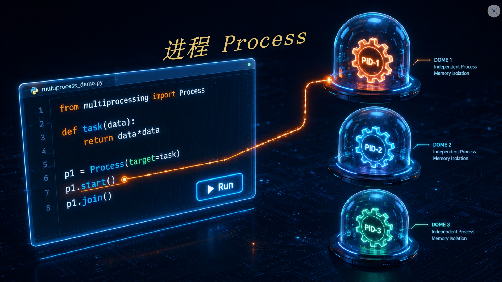

# Python 进程编程指南：从概念到实战

<!--  -->

## 一、进程的概念与特性

**进程是操作系统资源分配的基本单位。** 每个进程都有自己独立的地址空间、文件描述符、堆栈和其他系统资源。我们可以把进程想象成一座独立的"房子"，房子里的人（线程）可以自由活动，但不同房子之间的人不能直接交流，必须通过门（IPC 机制）传递信息。

### 进程的核心特性

- **天然隔离性**：一个进程崩溃不会影响其他进程
- **资源开销大**：创建和销毁进程需要分配和回收大量系统资源
- **多核利用**：不同进程可以运行在不同的 CPU 核心上，实现真正的并行

---

## 二、Python 进程编程基础

### 2.1 Process 类的基本使用

Python默认有个叫GIL（全局解释器）的机制，我们可以把它理解为一家饭店里只有一个“切菜台”。哪怕你招了10个厨师（线程），同一时间也只能有1个厨师在这个切菜台上切菜。所以，Python的常规多线程（threading）做CPU密集型任务时（如进行大量计算），其实是假并行，厨师们得排队用切菜台，速度实际并没有变快。

而进程（multiprocessing）则可以利用多个CPU核心，实现真正的并行计算，它直接不跟你玩排队游戏了，它的做法是：在旁边重新开一家分店。总店（主进程）：有自己的一套厨具和切菜台，分店（子进程）：有自己的全套厨具，这样每个厨师都在自己的分店里切自己的菜，便实现了同时干活（并行计算）。

```python
import multiprocessing
import time

def worker(name: str, seconds: int):
    print(f"Worker {name} 开始工作，将睡眠 {seconds} 秒")
    time.sleep(seconds)
    print(f"Worker {name} 工作完成")

if __name__ == '__main__':
    # 创建进程对象
    p1 = multiprocessing.Process(target=worker, args=("A", 2))
    p2 = multiprocessing.Process(target=worker, args=("B", 3))

    # 启动进程
    start_time = time.time()
    p1.start()
    p2.start()

    # 等待进程完成
    p1.join()
    p2.join()

    print(f"所有进程完成，总耗时: {time.time() - start_time:.2f} 秒")

    # 输出结果：
    # Worker A 开始工作，将睡眠 2 秒
    # Worker B 开始工作，将睡眠 3 秒
    # Worker A 工作完成
    # Worker B 工作完成
    # 所有进程完成，总耗时：3.06 秒
```

> **关键点**：
>
> - `start()` 方法启动进程，操作系统会创建一个新的进程执行 `target` 函数
> - `join()` 方法阻塞主进程，等待子进程完成。如果不调用 `join()`，主进程会立即退出，子进程可能成为"僵尸进程"
> - **跨平台注意事项**：Windows 无原生 fork，Python 仅支持 spawn 创建进程；spawn 会重新导入主模块，因此必须用 `if __name__ == '__main__'` 包裹进程创建代码，防止无限递归

### 2.2 进程池与 ProcessPoolExecutor

当需要创建大量进程时，使用进程池可以避免频繁创建和销毁进程的开销。`concurrent.futures.ProcessPoolExecutor` 提供了更高级的抽象。

```python
from concurrent.futures import ProcessPoolExecutor

def square(x: int) -> int:
    return x * x

if __name__ == '__main__':
    numbers = list(range(1, 11))

    # with语句：上下文管理器，自动创建/关闭进程池
    # max_workers：进程池中最多能运行的进程数
    with ProcessPoolExecutor(max_workers=4) as executor:
        # map: 将numbers中的每个元素传递给square函数
        # 4个进程并行计算
        results = list(executor.map(square, numbers))

    print(f"计算结果：{results}")
```

---

## 三、进程间通信（IPC）

由于进程拥有独立的地址空间，不同进程之间不能直接共享内存，必须通过专门的 IPC（Inter-Process Communication）机制进行通信。

### 3.1 Queue 与 Pipe

`multiprocessing.Queue` 是最常用的进程间通信方式，它基于管道和锁实现，是线程安全和进程安全的。

**通信原理**：

1. 发送方将数据通过 `pickle` 序列化
2. 序列化后的数据通过操作系统管道传递
3. 接收方将数据反序列化

**生活类比**：就像把想法写在纸上装进信封，通过邮局寄给对方，对方收到后拆开信封阅读内容。

```python
import multiprocessing

def producer(queue: multiprocessing.Queue):
    for i in range(5):
        queue.put(f"消息 {i}")
        print(f"生产者发送: 消息 {i}")
    queue.put(None)  # 发送哨兵值表示结束

def consumer(queue: multiprocessing.Queue):
    while True:
        message = queue.get()
        if message is None:
            break
        print(f"消费者接收: {message}")

if __name__ == '__main__':
    queue = multiprocessing.Queue()
    p1 = multiprocessing.Process(target=producer, args=(queue,))
    p2 = multiprocessing.Process(target=consumer, args=(queue,))
    p1.start()
    p2.start()
    p1.join()
    p2.join()
```

> **限制**：不能传递 lambda 函数、文件对象、套接字等不可序列化的数据。如果需要传递这些对象，可以考虑使用 `multiprocessing.Manager` 或共享内存。

### 3.2 共享内存

对于需要频繁交换大量数据的场景，使用共享内存可以避免序列化和反序列化的开销。`multiprocessing.Value` 和 `multiprocessing.Array` 提供了简单的共享内存支持。

```python
# 创建4个进程共享同一个计数器，每个进程对计数器累加 10000 次，最终结果为 40000
import multiprocessing

def increment_counter(counter: multiprocessing.Value):
    for _ in range(10000):
        with counter.get_lock():  # 必须加锁防止竞态条件
            counter.value += 1

if __name__ == '__main__':
    counter = multiprocessing.Value('i', 0)  # 'i'表示整数类型(int)，初始值为0

    # 创建4个子进程，所有进程共享一个counter对象
    processes = [multiprocessing.Process(target=increment_counter, args=(counter,))
                 for _ in range(4)]

    # 启动所有子进程，开始并行执行累加
    for p in processes:
        p.start()

    # 主进程等待所有子进程执行完毕（阻塞等待）
    for p in processes:
        p.join()

    print(f"最终计数器值: {counter.value}")  # 输出: 40000
```

> **竞态条件**：多个进程同时竞争修改同一个共享资源，导致操作被打断、数据计算错误。
>
> **`get_lock()`**：获取 Value 对象的互斥锁，确保在同一时间只允许一个进程执行锁内的代码，从而避免竞态条件。

---

## 四、进程执行时间线

进程的典型生命周期包括：**创建 → 就绪 → 运行 → 阻塞 → 终止**。下图直观展示了多进程的并行执行过程：


---

## 五、完整实战：蒙特卡洛方法求 π

蒙特卡洛方法是一种通过随机抽样来计算 π 值的经典 **CPU 密集型** 算法。其核心思想是：在一个单位正方形内随机投点，统计落在单位圆内的点的比例，该比例趋近于 π/4。

```python
import random
import time
from concurrent.futures import ProcessPoolExecutor

def monte_carlo_pi(n: int) -> int:
    """计算n个随机点中落在单位圆内的数量"""
    count = 0
    for _ in range(n):
        x = random.random()
        y = random.random()
        if x*x + y*y <= 1:
            count += 1
    return count

def single_process(total_points: int) -> float:
    """单进程计算π"""
    start_time = time.time()
    count = monte_carlo_pi(total_points)
    pi = 4 * count / total_points
    print(f"单进程计算结果: π ≈ {pi:.6f}")
    print(f"单进程耗时: {time.time() - start_time:.2f} 秒")
    return pi

def multi_process(total_points: int, num_processes: int) -> float:
    """多进程计算π"""
    start_time = time.time()
    points_per_process = total_points // num_processes  # 拆分任务

    with ProcessPoolExecutor(max_workers=num_processes) as executor:
        counts = list(executor.map(monte_carlo_pi, [points_per_process] * num_processes))

    total_count = sum(counts)  # 汇总所有进程的结果
    pi = 4 * total_count / total_points
    print(f"多进程计算结果: π ≈ {pi:.6f}")
    print(f"多进程耗时: {time.time() - start_time:.2f} 秒")
    return pi

if __name__ == '__main__':
    TOTAL_POINTS = 100_000_000
    NUM_PROCESSES = 4  # 开启4个进程（对应4核CPU）

    print("开始单进程计算...")
    single_process(TOTAL_POINTS)

    print("\n开始多进程计算...")
    multi_process(TOTAL_POINTS, NUM_PROCESSES)

    # 输出结果（4 核 CPU）：
    # 开始单进程计算...
    # 单进程计算结果：π ≈ 3.141603
    # 单进程耗时：8.21 秒
    #
    # 开始多进程计算...
    # 多进程计算结果：π ≈ 3.141551
    # 多进程耗时：2.27 秒
```

### 代码详解

**任务拆分**：
```python
points_per_process = total_points // num_processes  # 1亿 ÷ 4 = 2500万
```
将总任务平均拆分给每个进程，每个进程只需要计算 2500 万次采样，而不是单进程的 1 亿次。

**进程池核心三步骤**：

① `with ProcessPoolExecutor(max_workers=num_processes) as executor`
创建进程池，固定创建 4 个工作进程，`executor` 是进程池对象，负责分发任务、管理进程生命周期。

② `[points_per_process] * num_processes`
生成参数列表 `[25000000, 25000000, 25000000, 25000000]`，给 4 个进程分别分配 2500 万的采样任务。

③ `executor.map(函数, 参数列表)`
`map` 是进程池的自动任务分发工具，把参数列表里的 4 个数值自动分给 4 个空闲进程，每个进程调用 `monte_carlo_pi` 函数并行执行，互不干扰。

④ `list(...)`
`executor.map` 返回迭代器，用 `list()` 转为列表，最终得到 `[进程1的结果, 进程2的结果, 进程3的结果, 进程4的结果]`。

### 性能分析

从输出结果可以看到，在 4 核 CPU 上：
- **单进程**：8.21 秒
- **多进程（4核）**：2.27 秒

加速比约为 **3.6 倍**，接近理论极限的 4 倍，充分体现了 CPU 密集型任务在多核处理器上的并行优势。

---

## 总结

| 主题 | 要点 |
|------|------|
| 进程特性 | 隔离性强、资源开销大、支持多核并行 |
| Process 类 | `start()` 启动、`join()` 等待、跨平台注意事项 |
| 进程池 | `ProcessPoolExecutor` 自动管理进程生命周期 |
| IPC（Queue） | 基于 pickle 序列化的管道通信 |
| 共享内存 | `Value`/`Array` + 锁机制避免竞态条件 |
| 实战案例 | 蒙特卡洛求 π，加速比接近线性 |

**何时使用多进程？**
- CPU 密集型任务（如数学计算、图像处理、数据压缩）
- 需要利用多核处理器实现真正的并行
- 任务之间相互独立，不需要频繁通信

**何时应谨慎？**
- I/O 密集型任务（此时多线程或异步编程更高效）
- 任务需要频繁的进程间通信（IPC 开销可能抵消并行收益）
- 需要共享大量复杂数据结构（序列化成本高）

以上就是本篇python进程编程的讲解，觉得有帮助的话，欢迎点赞👍收藏🔖关注👀~