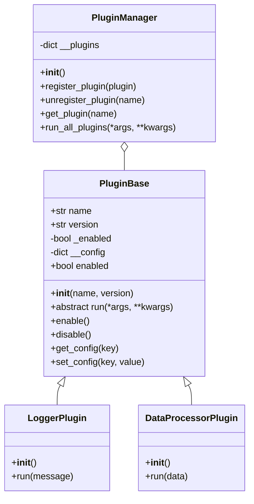

# draft

## 面向过程 VS 面向过程
编程案例：
```python
class Circle:
    def __init__(self, r):
        self.r = r
    
    def get_area(self):
        return 3.14 * self.r * self.r
    
    def get_perimeter(self):
        return 2 * 3.14 * self.r

c1 = Circle(5)

print("面积：", c1.get_area())
print("周长：", c1.get_perimeter())
```

## OOP三大特性——封装、继承、多态
### 封装

1. **单下划线——约定的细节**：
```python
import hashlib
class User:
    def __init__(self, username, password):
        self.username = username  # 公共属性
        self._password_hash = self._hash_password(password)  # 受保护的属性
    
    def _hash_password(self, password):  # 受保护方法
        # 内部实现的密码哈希函数
        return hashlib.sha256(password.encode()).hexdigest()
    
    def verify_password(self, password):
        # 对外暴露的方法，用于验证密码
        return self._password_hash == self._hash_password(password)

```

2. **双下划线——名称改写机制**：
```python
class Base:
    def __init__(self):
        self.__private = "父类私有属性"
        self._protected = "父类受保护属性"
    
    def get_private(self):
        return self.__private

class Derived(Base):
    def __init__(self):
        super().__init__()
        self.__private = "子类私有属性"  # 不会覆盖父类的__private
        self._protected = "子类受保护属性"  # 不会覆盖父类的_protected
        # 覆盖规则：只有名字完全相同的属性，才会覆盖；名字不同（差下划线）就是独立属性。

# 实例化并查看属性
d = Derived()
print(d._protected)  # 输出：子类受保护属性
print(d.get_private())  # 输出：父类私有属性

# 查看对象的__dict，揭示名称改写的真相
print(d.__dict__)
# 输出：{'_Base__private': '父类私有属性', '_protected': '子类受保护属性', '_Derived__private': '子类私有属性'}
```

**绕过演示（仅用于调试）**：

```python
# 可以直接访问改写后的属性，但永远不要在生产代码中这样做
print(d._Base__private)  # 输出: 父类私有属性
print(d._Derived__private)  # 输出: 子类私有属性
```

3. **受控访问的核心：@property 与描述符协议**：

**案例 1：温度转换类**
```python
class Temperature:
    def __init__(self, celsius=0):
        self.celsius = celsius  # 直接调用setter
    
    @property
    def celsius(self):
        """摄氏温度""""
        return self._celsius
    
    # @xxx.setter：setter（设置值）
    @celsius.setter
    def celsius(self, value):
        if value < -273.15:
            raise ValueError("温度不能低于绝对零度(-273.15°C)")
        self._celsius = value
    
    @property
    def fahrenheit(self):
        """华氏温度""""
        return self.celsius * 1.8 + 32
    
    @fahrenheit.setter
    def fahrenheit(self, value):
        self.celsius = (value - 32) / 1.8
    
    # @xxx.deleter：deleter（删除属性）
    @fahrenheit.deleter
    def fahrenheit(self):
        print("删除华氏温度属性，重置为0℃")
        self.celsius = 0

# 使用示例
t = Temperature(25)
print(t.celsius)  # 输出: 25
print(t.fahrenheit)  # 输出: 77.0

t.fahrenheit = 32
print(t.celsius)  # 输出: 0.0

del t.fahrenheit  # 输出: 删除华氏温度属性，重置为0℃
print(t.celsius)  # 输出: 0.0
```

**案例 2：手工实现 MyProperty 描述符**
- `__get__(self, instance, owner)`：获取属性值
- `__set__(self, instance, value)`：设置属性值
- `__delete__(self, instance)`：删除属性

```python
class MyProperty:
    def __init__(self, fget=None, fset=None, fdel=None):
        self.fget = fget
        self.fset = fset
        self.fdel = fdel
        
    def __get__(self, instance, owner):
        if instance is None:
            return self
        if self.fget is not None:
            raise AttributeError("unreadable attribute")
        return self.fget(instance)
    
    def __set__(self, instance, value):
        if self.fset is None:
            raise AttributeError("can't set attribute")
        self.fset(instance, value)
    
    def __delete__(self, instance):
        if self.fdel is None:
            raise AttributeError("can't delete attribute")
        self.fdel(instance)
    
    def getter(self, fget):
        # return 新的MyProperty(新的getter, 旧的setter, 旧的deleter)
        return type(self)(fget, self.fset, self.fdel)
    
    def setter(self, fset):
        # return 新的MyProperty(旧的getter, 新的setter, 旧的deleter)
        return type(self)(self.fget, fset, self.fdel)
    
    def deleter(self, fdel):
        # return 新的MyProperty(旧的getter, 旧的setter, 新的deleter)
        return type(self)(self.fget, self.fset, fdel)

# 使用MyProperty重写Temperature类
class Temperature:
    def __init__(self, celsius=0):
        self.celsius = celsius
    
    @MyProperty
    def celsius(self):
        return self._celsius
    
    @celsius.setter
    def celsius(self, value):
        if value < -273.15:
            raise ValueError("温度不能低于绝对零度")
        self._celsius = value
```

**案例 3：银行账户类**
```python
from datetime import datetime
class BankAccount:
    def __init__(self, account_number, initial_balance=0):
        self.account_number = account_number
        self.__balance = initial_balance  # 用双下划线隐藏余额
        self.__transaction_history = []  # 交易记录
    
    @property
    def balance(self):
        """只读的余额属性"""
        return self.__balance
    
    def deposit(self, amount):
        if amount <= 0:
            raise ValueError("存款金额必须为正数")
        self.__balance += amount
        self.__transaction_history.append(("存款", amount, datetime.now()))
    
    def withdraw(self, amount):
        if amount <= 0:
            raise ValueError("取款金额必须为正数")
        if amount > self.__balance:
            raise ValueError("余额不足")
        self.__balance -= amount
        self.__transaction_history.append(("取款", amount, datetime.now()))
    
    def get_transaction_history(self):
        """获取交易记录"""
        return self.__transaction_history.copy()

# 使用示例
account = BankAccount("123456", 1000)
print("账号：", account.account_number)
print("初始余额：", account.balance)
account.deposit(500)
print("存款后余额：", account.balance)
account.withdraw(200)
print("取款后余额：", account.balance)
print("\n交易记录：")
for record in account.get_transaction_history():
    print(record)

# 测试非法操作
# account.withdraw(2e00)  # 余额不足，报错
# account.deposit(-100)   # 负数存款，报错
# account.balance= 99999   # 只读属性，无法修改
```

### 继承：复用与层次的底层逻辑

1. **单继承与 super () 的协作**

```python
class Vehicle:
    def __init__(self, brand, model, year):
        self.brand = brand
        self.model = model
        self.year = year
    
    def start(self):
        return f"{self.brand} {self.model} 启动了"

class ElectricCar(Vehicle):
    def __init__(self, brand, model, year, battery_capacity):
        super().__init__(brand, model, year)
        self.battery_capacity = battery_capacity
    
    def start(self):
        parent_start = super().start()
        return f"{parent_start}, 电机嗡嗡作响"

class Tesla(ElectricCar):
    def __init__(self, brand, model, year, battery_capacity, autopilot_version):
        super().__init__("Tesla", model, year, battery_capacity)
        self.autopilot_version = autopilot_version
    
    def start(self):
        return f"{super().start()}, 自动驾驶系统v{self.autopilot_version}已激活"

# 使用示例
model3 = Tesla("Model 3", 2026, 75, "FSD")
print(model3.start())  # 输出: Tesla Model 3 启动了，电机嗡嗡作响，自动驾驶系统vFSD已激活
```

2. **菱形继承与 MRO**
```python
class A:
    def __init__(self):
        print("A初始化")
        self.value = "A"

class B(A):
    def __init__(self):
        print("B初始化开始")
        super().__init__()
        print("B初始化结束")
        self.value += "B"

class C(A):
    def __init__(self):
        print("C初始化开始")
        super().__init__()
        print("C初始化结束")
        self.value += "C"

class D(B, C):
    def __init__(self):
        print("D初始化开始")
        super().__init__()
        print("D初始化结束")
        self.value += "D"

# 查看D的MRO
print(D.__mro__)
# 输出: (<class '__main__.D'>, <class '__main__.B'>, <class '__main__.C'>, <class '__main__.A'>, <class 'object'>)

# 实例化D，观察初始化顺序
d = D()
print(d.value)
```

3. **反面教材：super () 的错误使用**

错误示例：
```python
class A:
    def __init__(self, a):
        self.a = a

class B(A):
    def __init__(self, a, b):
        super().__init__(a)
        self.b = b

class C(A):
    def __init__(self, a, c):
        super().__init__(a)
        self.c = c

class D(B, C):
    def __init__(self, a, b, c, d):
        super().__init__(a, b)  # 错误！这会调用C.__init__，但它需要3个参数
        self.d = d

# 实例化会报错
d = D(1, 2, 3, 4)
# TypeError: C.__init__() missing 1 required positional argument: 'c'
```

正确做法：
```python
class A:
    def __init__(self, a, **kwargs):
        self.a = a
        super().__init__(**kwargs)

class B(A):
    def __init__(self, b, **kwargs):
        super().__init__(**kwargs)
        self.b = b

class C(A):
    def __init__(self, c, **kwargs):
        super().__init__(**kwargs)
        self.c = c

class D(B, C):
    def __init__(self, d, **kwargs):
        super().__init__(**kwargs)
        self.d = d

# 实例化
d = D(a=1, b=2, c=3, d=4)
print(d.a, d.b, d.c, d.d)  # 输出: 1 2 3 4
```

4. **组合优于继承——原则与实践**

*案例：电动汽车的电池*
```python
# 不推荐做法：用继承实现电池功能
class Vehicle:
    def __init__(self, brand, model):
        self.brand = brand
        self.model = model

class ElectricVehicle(Vehicle):
    def __init__(self, brand, model, battery_capacity):
        super().__init__(brand, model)
        self.battery_capacity = battery_capacity
    
    def charge(self):
        return f"充电中，容量{self.battery_capacity}kWh"

# 推荐做法：用组合实现电池功能
class Battery:
    def __init__(self, capacity):
        self.capacity = capacity
        self.charge_level = 100
    
    def charge(self):
        self.charge_level = 100
        return f"电池充电完成，容量{self.capacity}kWh"
    
    def discharge(self):
        self.charge_level = max(0, self.charge_level - 10)
        return self.charge_level

class ElectricCar(Vehicle):
    def __init__(self, brand, model, battery_capacity):
        super().__init__(brand, model)
        self.battery = Battery(battery_capacity)
    
    def charge(self, distance):
        energy_need = distance * 0.2
        remaining = self.battery.discharge(energy_need)
        return f"行驶{distance}公里，剩余电量{remaining}%"
```

*重构案例：飞行潜水车*
```python
# 多继承实现
class Vehicle:
    def __init__(self, brand, model):
        self.brand = brand
        self.model = model

class Flyable:
    def fly(self):
        return "正在飞行"

class Submersible:
    def dive(self):
        return "正在下潜"

class FlightSubmersible(Vehicle, Flyable, Submersible):
    def __init__(self, brand, model, max_altitude, max_depth):
        super().__init__(brand, model)
        self.max_altitude = max_altitude
        self.max_depth = max_depth
        self.flight_system = FlightSystem(max_altitude)
        self.dive_system = DiveSystem(max_depth)
```
```python
# 用组合重构
class FlightSystem:
    def __init__(self, max_altitude):
        self.max_altitude = max_altitude
    
    def fly(self):
        return f"正在飞行，最高高度{self.max_altitude}米"

class DiveSystem:
    def __init__(self, max_depth):
        self.max_depth = max_depth
    
    def dive(self):
        return f"正在下潜，最大深度{self.max_depth}米"

class AmphibiousVehicle(Vehicle):
    def __init__(self, brand, model, max_altitude, max_depth):
        super().__init__(brand, model)
        self.flight_system = FlightSystem(max_altitude)
        self.dive_system = DiveSystem(max_depth)
    
    def fly(self):
        return self.flight_system.fly()
    
    def dive(self):
        return self.dive_system.dive()
```

### 多态：接口统一，实现各异

1. **鸭子类型**

```python
class Dog:
    def speak(self):
        return "汪汪汪"

class Cat:
    def speak(self):
        return "喵喵喵"

class Robot:
    def speak(self):
        return "哔哔哔，我是人机"

# 统一的接口函数
def make_speak(animal):
    print(animal.speak())

# 不同的对象，同一个接口
make_speak(Dog())
make_speak(Cat())
make_speak(Robot())
```

2. **协议：Python 的隐式接口**

```python
class DatabaseConnection:
    def ___init__(self, db_name):
        self.db_name = db_name
    
    def __enter__(self):
        print(f"连接到数据库{self.db_name}")
        self.connection = f"连接对象{self.db_name}"
        return self.connection
    
    def __exit__(self, exc_type, exc_val, exc_tb):
        print(f"关闭数据库{self.db_name}的连接")
        if exc_type is not None:
            print(f"发生异常: {exc_val}")
        # 返回True表示异常已经被处理，False表示继续传播
        return False

with DatabaseConnection("my_db") as conn:
    print(f"使用{conn}执行查询")
# 输出：
# 连接到数据库my_db
# 使用连接对象(my_db)执行查询
# 关闭数据库my_db的连接
```

3. **用抽象基类(ABC)建立显示接口**
```python
from abc import ABC, abstractmethod
import math

class Shape(ABC):
    @abstractmethod
    #  abstractmethod：装饰器，用来标记抽象方法。
    def area(self):
        pass
    
    @abstractmethod
    def perimeter(self):
        pass

class Circle(Shape):
    def __init__(self, radius):
        self.radius = radius
    
    def area(self):
        return math.pi * self.radius ** 2
    
    def perimeter(self):
        return 2 * math.pi * self.radius

class Rectangle(Shape):
    def __init__(self, width, height):
        self.width = width
        self.height = height
    
    def area(self):
        return self.width * self.height
    
    def perimeter(self):
        return 2 * (self.width + self.height)

shapes = [Circle(5), Rectangle(3, 4)]
for shape in shapes:
    print(f"(type(shape).__name__)面积{shape.area():.2f}")
    print(f"(type(shape).__name__)周长{shape.perimeter():.2f}")
```

4. **进阶：__subclasshook__魔法**

```python
from abc import ABC, abstractmethod
class Shape(ABC):
    @abstractmethod
    def area(self):
        pass
    
    @abstractmethod
    def perimeter(self):
        pass
    
    # 子类钩子
    @classmethod
    def __subclasshook__(cls, subclass):
        if cls is Shape:
            # 检查subclass是否实现了area和perimeter方法，并能够调用
            if (hasattr(subclass, 'area') and callable(subclass, area) and
                hasattr(subclass, 'perimeter') and callable(subclass, perimeter)):
                return True  # 满足：认定为子类
        return NotImplemented  # 不满足：交给python默认判断规则

# 定义一个没有继承Shape但实现了所有方法的类
class Square:
    def __init__(self, side):
        self.side = side
    
    def area(self):
        return self.side ** 2
    
    def perimeter(self):
        return 4 * self.side

# isinstance(对象, 类) → 判断：这个对象是不是这个类的实例？
print(isinstance(Square(5), Shape))  # True
# issubclass(子类, 父类) → 判断：这个类是不是那个类的子类？
print(issubclass(Square, Shape))  # True
```

5. **静态鸭子类型：Protocol**

```python
from typing import Protocol

class Drawable(Protocol):
    def draw(self) -> None:
        ...

class Circle:
    def draw(self) -> None:
        print("画一个圆")

class Square:
    def draw(self) -> None:
        print("画一个正方形")

# 标注参数类型：shape 必须符合 Drawable 协议（有 draw 方法）
def draw_shape(shape: Drawable) -> None:
    shape.draw()

# Circle / Square 没有 Drawable 的继承关系，但结构匹配 → 类型检查通过
# 类型检查器会认为Circle和Square都是Drawable的子类
draw_shape(Circle())
draw_shape(Square())
```

6. **多态的工程化应用 —— 策略模式**

```python
from abc import ABC, abstractmethod

# 策略接口
class PaymentStrategy(ABC):
    @abstractmethod
    def pay(self, amount: float) -> bool:
        pass

# 具体策略
class CreditCardPayment(PaymentStrategy):
    def __init__(self, card_number, expiry_date, cvv):
        self.card_number = card_number
        self.expiry_date = expiry_date
        self.cvv = cvv
    
    def pay(self, amount: float) -> bool:
        print(f"使用信用卡【***{self.card_number[-4:]}】支付：${amount:.2f}")
        # 这里是实际的信用卡支付逻辑
        return True

class PayPalPayment(PaymentStrategy):
    def __init__(self, email):
        self.email = email
    
    def pay(self, amount: float) -> bool:
        print(f"使用PayPal账户【{self.email}】支付：${amount:.2f}")
        # 这里是实际的PayPal支付逻辑
        return True

class AlipayPayment(PaymentStrategy):
    def __init__(self, alipay_id):
        self.alipay_id = alipay_id
    
    def pay(self, amount: float) -> bool:
        print(f"使用支付宝账户【{self.alipay_id}】支付：${amount:.2f}")
        # 这里是实际的支付宝支付逻辑
        return True

# 上下文类
class PaymentProcessor:
    def __init__(self, strategy: PaymentStrategy):
        self.strategy = strategy
    
    def set_strategy(self, strategy: PaymentStrategy):
        self.strategy = strategy
    
    def process_payment(self, amount: float) -> bool:
        return self.strategy.pay(amount)

# 使用示例
processor = PaymentProcessor(CreditCardPayment("4111-1111-1111-1111", "12/28", "123"))
processor.process_payment(100.0)

# 动态切换支付方式
processor.set_strategy(PayPalPayment("user@example.com"))
processor.process_payment(50.0)
```

### 三位一体：三大特性协同构建插件框架

1. **框架设计**



2. **完整代码实现**

```python
from abc import ABC, abstractmethod
from typing import Dict, List, Any

class PluginBase(ABC):
    def __init__(self, name: str, version: str):
        self.name = name
        self.version = version
        self._enabled = True
        self.__config = {}
    
    @property
    def enabled(self) -> bool:
        return self._enabled
    
    def enable(self) -> None:
        self._enabled = True
        print(f"插件 {self.name} v{self.version} 已启用")
    
    def disable(self) -> None:
        self._enabled = False
        print(f"插件 {self.name} v{self.version} 已禁用")
    
    def get_config(self, key: str, default: Any = None) -> Any:
        return self.__config.get(key, default)
    
    def set_config(self, key: str, value: Any) -> None:
        self.__config[key] = value
        print(f"插件 {self.name} 配置【{key} = {value}】已设置")
    
    @abstractmethod
    def run(self, *args, **kwargs) -> Any:
        pass

class LoggerPlugin(PluginBase):
    """日志插件"""
    
    def __init__(self):
        super().__init__("Logger", "1.0.0")
        self.set_config("log_level", "INFO")
    
    def run(self, *args, **kwargs) -> None:
        if not self.enabled:
            return
        log_level = self.get_config("log_level")
        print(f"[{log_level}] {args}")

class DataProcessorPlugin(PluginBase):
    """数据处理插件"""
    
    def __init__(self):
        super().__init__("DataProcessor", "1.1.0")
        self.set_config("process_mode", "normal")
    
    def run(self, *args, **kwargs) -> List[int]:
        data = kwargs.get("data", [])
        if not self.enabled:
            return data
        process_mode = self.get_config("process_mode")
        if process_mode == "normal":
            return [x * 2 for x in data]
        elif process_mode == "reverse":
            return [x ** 2 for x in data]
        else:
            return data
    

class PluginManager:
    """插件管理器"""

    def __init__(self):
        self.__plugins: Dict[str, PluginBase] = {}
    
    def register_plugin(self, plugin: PluginBase) -> None:
        if plugin.name in self.__plugins:
            raise ValueError(f"插件 {plugin.name} 已存在")
        self.__plugins[plugin.name] = plugin
        print(f"成功注册插件 {plugin.name} v{plugin.version} ")
    
    def unregister_plugin(self, plugin_name: str) -> None:
        if plugin_name not in self.__plugins:
            raise ValueError(f"插件 {plugin_name} 不存在")
        del self.__plugins[plugin_name]
        print(f"成功注销插件 {plugin_name}")
    
    def get_plugin(self, plugin_name: str) -> PluginBase:
        return self.__plugins.get(plugin_name)
    
    def run_all_plugins(self, *args, **kwargs) -> None:
        results = {}
        for plugin_name, plugin in self.__plugins.items():
            if plugin.enabled:
                try:
                    results[plugin_name] = plugin.run(*args, **kwargs)
                except Exception as e:
                    results[plugin_name] = f"运行插件 {plugin_name} 时出错：{e}"
        return results

if __name__ == "__main__":
    # 创建插件管理器
    manager = PluginManager()
    
    # 注册插件
    manager.register_plugin(LoggerPlugin())
    manager.register_plugin(DataProcessorPlugin())
    
    # 获取并配置插件
    logger = manager.get_plugin("Logger")
    logger.set_config("log_level", "DEBUG")
    
    processor = manager.get_plugin("DataProcessor")
    processor.set_config("process_mode", "square")
    
    # 运行所有插件
    print("\n运行所有插件:")
    results = manager.run_all_plugins("系统启动", data=[1, 2, 3, 4, 5])
    print(f"运行结果: {results}")
    
    # 禁用一个插件
    print("\n禁用DataProcessor插件:")
    processor.disable()
    
    # 再次运行
    print("\n再次运行所有插件:")
    results = manager.run_all_plugins("系统运行中", data=[1, 2, 3, 4, 5])
    print(f"运行结果: {results}")
```

